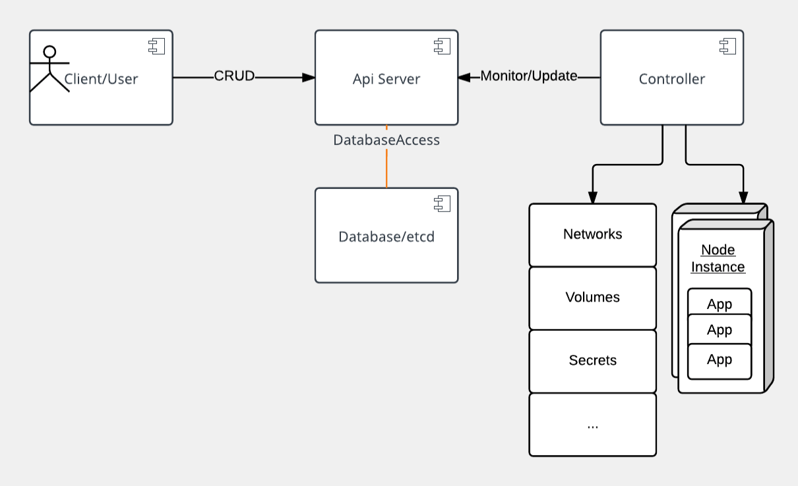
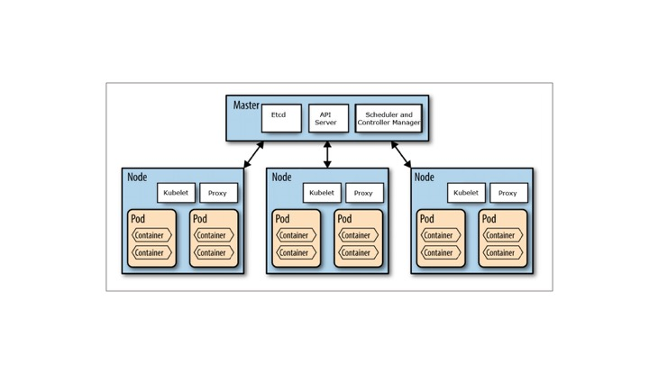

# IBM Cloud Kubernetes Service Lab


## An introduction to containers

Hey, are you looking for a containers 101 course? Check out our [Docker Essentials](https://developer.ibm.com/courses/all/docker-essentials-extend-your-apps-with-containers/).

Containers allow you to run securely isolated applications with quotas on system resources. Containers started out as an individual feature delivered with the linux kernel. Docker launched with making containers easy to use and developers quickly latched onto that idea. Containers have also sparked an interest in microservice architecture, a design pattern for developing applications in which complex applications are down into smaller, composable pieces which work together.

Watch this [video](https://www.youtube.com/watch?v=wlBhtc31I8c) to learn about production uses of containers.

## Objectives

This lab is an introduction to using Docker containers on Kubernetes in the IBM Cloud Kubernetes Service. By the end of the course, you'll achieve these objectives:

* Understand core concepts of Kubernetes
* Build a Docker image and deploy an application on Kubernetes in the IBM Cloud Kubernetes Service
* Control application deployments, while minimizing your time with infrastructure management
* Add AI services to extend your app
* Secure and monitor your cluster and app

## Prerequisites

* A Pay-As-You-Go or Subscription [IBM Cloud account](https://console.bluemix.net/registration/)

## Virtual machines

Prior to containers, most infrastructure ran not on bare metal, but atop hypervisors managing multiple virtualized operating systems (OSes). This arrangement allowed isolation of applications from one another on a higher level than that provided by the OS. These virtualized operating systems see what looks like their own exclusive hardware. However, this also means that each of these virtual operating systems are replicating an entire OS, taking up disk space.

## Containers

Containers provide isolation similar to VMs, except provided by the OS and at the process level. Each container is a process or group of processes run in isolation. Typical containers explicitly run only a single process, as they have no need for the standard system services. What they usually need to do can be provided by system calls to the base OS kernel.

The isolation on linux is provided by a feature called 'namespaces'. Each different kind of isolation (IE user, cgroups) is provided by a different namespace.

This is a list of some of the namespaces that are commonly used and visible to the user:

* PID - process IDs
* USER - user and group IDs
* UTS - hostname and domain name
* NS - mount points
* NET - network devices, stacks, and ports
* CGROUPS - control limits and monitoring of resources

## VM vs container

Traditional applications are run on native hardware. A single application does not typically use the full resources of a single machine. We try to run multiple applications on a single machine to avoid wasting resources. We could run multiple copies of the same application, but to provide isolation we use VMs to run multiple application instances (VMs) on the same hardware. These VMs have full operating system stacks which make them relatively large and inefficient due to duplication both at runtime and on disk.


Containers allow you to share the host OS. This reduces duplication while still providing the isolation. Containers also allow you to drop unneeded files such as system libraries and binaries to save space and reduce your attack surface. If SSHD or LIBC are not installed, they cannot be exploited.

## Get set up

Before we dive into Kubernetes, you need to provision a cluster for your containerized app. Then you won't have to wait for it to be ready for the subsequent labs.

1. You must install the CLIs per <https://console.ng.bluemix.net/docs/containers/cs_cli_install.html>. If you do not yet have these CLIs and the Kubernetes CLI, do [lab 0](Lab0) before starting the course.
2. If you haven't already, provision a cluster. This can take a few minutes, so let it start first: `ibmcloud cs cluster-create --name <name-of-cluster>`
3. After creation, before using the cluster, make sure it has completed provisioning and is ready for use. Run `ibmcloud cs clusters` and make sure that your cluster is in state "deployed".
4. Then use `ibmcloud cs workers <name-of-cluster>` and make sure that all worker nodes are in state "normal" with Status "Ready".

## Kubernetes and containers: an overview

Let's talk about Kubernetes orchestration for containers before we build an application on it. We need to understand the following facts about it:

* What is Kubernetes, exactly?
* How was Kubernetes created?
* Kubernetes architecture
* Kubernetes resource model
* Kubernetes at IBM
* Let's get started

## What is Kubernetes?

Now that we know what containers are, let's define what Kubernetes is. Kubernetes is a container orchestrator to provision, manage, and scale applications. In other words, Kubernetes allows you to manage the lifecycle of containerized applications within a cluster of nodes (which are a collection of worker machines, for example, VMs, physical machines etc.).

Your applications may need many other resources to run such as Volumes, Networks,  and Secrets that will help you to do things such as connect to databases, talk to firewalled backends, and secure keys. Kubernetes helps you add these resources into your application. Infrastructure resources needed by applications are managed declaratively.

**Fast fact:** Other orchestration technologies are Mesos and Swarm.

The key paradigm of kubernetes is it’s Declarative model. The user provides the "desired state" and Kubernetes will do it's best make it happen. If you need 5 instances, you do not start 5 separate instances on your own but rather tell Kubernetes that you need 5 instances and Kubernetes will reconcile the state automatically. Simply at this point you need to know that you declare the state you want and Kubernetes makes that happen. If something goes wrong with one of your instances and it crashes, Kubernetes still knows the desired state and creates a new instances on an available node.

**Fun to know:** Kubernetes goes by many names. Sometimes it is shortened to _k8s_ (losing the internal 8 letters), or _kube_. The word is rooted in ancient Greek and means "Helmsman". A helmsman is the person who steers a ship. We hope you can seen the analogy between directing a ship and the decisions made to orchestrate containers on a cluster.

## How was Kubernetes created?

Google wanted to open source their knowledge of creating and running the internal tools Borg & Omega. It adopted Open Governance for Kubernetes by starting the Cloud Native Computing Foundation (CNCF) and giving Kubernetes to that foundation, therefore making it less influenced by Google directly. Many companies such as RedHat, Microsoft, IBM and Amazon quickly joined the foundation.

Main entry point for the kubernetes project is at [http://kubernetes.io](http://kubernetes.io) and the source code can be found at [https://github.com/kubernetes](https://github.com/kubernetes).

## Kubernetes architecture

At its core, Kubernetes is a data store (etcd). The declarative model is stored in the data store as objects, that means when you say I want 5 instances of a container then that request is stored into the data store. This information change is watched and delegated to Controllers to take action. Controllers then react to the model and attempt to take action to achieve the desired state. The power of Kubernetes is in its simplistic model.

As shown, API server is a simple HTTP server handling create/read/update/delete(CRUD) operations on the data store. Then the controller picks up the change you wanted and makes that happen. Controllers are responsible for instantiating the actual resource represented by any Kubernetes resource. These actual resources are what your application needs to allow it to run successfully.



## Kubernetes resource model

Kubernetes Infrastructure defines a resource for every purpose. Each resource is monitored and processed by a controller. When you define your application, it contains a collection of these resources. This collection will then be read by Controllers to build your applications actual backing instances. Some of resources that you may work with are listed below for your reference, for a full list you should go to [https://kubernetes.io/docs/concepts/](https://kubernetes.io/docs/concepts/). In this class we will only use a few of them, like Pod, Deployment, etc.

* Config Maps holds configuration data for pods to consume.
* Daemon Sets ensure that each node in the cluster runs this Pod
* Deployments defines a desired state of a deployment object
* Events provides lifecycle events on Pods and other deployment objects
* Endpoints allows a inbound connections to reach the cluster services
* Ingress is a collection of rules that allow inbound connections to reach the cluster services
* Jobs creates one or more pods and as they complete successfully the job is marked as completed.
* Node is a worker machine in Kubernetes
* Namespaces are multiple virtual clusters backed by the same physical cluster
* Pods are the smallest deployable units of computing that can be created and managed in Kubernetes
* Persistent Volumes provides an API for users and administrators that abstracts details of how storage is provided from how it is consumed
* Replica Sets ensures that a specified number of pod replicas are running at any given time
* Secrets are intended to hold sensitive information, such as passwords, OAuth tokens, and ssh keys
* Service Accounts provides an identity for processes that run in a Pod
* Services  is an abstraction which defines a logical set of Pods and a policy by which to access them - sometimes called a micro-service.
* Stateful Sets is the workload API object used to manage stateful applications.
* and more...



Kubernetes does not have the concept of an application. It has simple building blocks that you are required to compose. Kubernetes is a cloud native platform where the internal resource model is the same as the end user resource model.

## Key resources

A Pod is the smallest object model that you can create and run. You can add labels to a pod to identify a subset to run operations on. When you are ready to scale your application you can use the label to tell Kubernetes which Pod you need to scale. A Pod typically represent a process in your cluster. Pods contain at least one container that runs the job and additionally may have other containers in it called sidecars for monitoring, logging, etc. Essentially a Pod is a group of containers.

When we talk about a application, we usually refer to group of Pods. Although an entire application can be run in a single Pod, we usually build multiple Pods that talk to each other to make a useful application. We will see why separating the application logic and backend database into separate Pods will scale better when we build an application shortly.

Services define how to expose your app as a DNS entry to have a stable reference. We use query based selector to choose which pods are supplying that service.

The user directly manipulates resources via yaml:

```bash
kubectl (create|get|apply|delete) -f myResource.yaml
```

Kubernetes provides us with a client interface through ‘kubectl’. Kubectl commands allow you to manage your applications, manage cluster and cluster resources, by modifying the model in the data store.

## Kubernetes application deployment workflow


1. User via "kubectl" deploys a new application. Kubectl sends the request to the API Server.
2. API server receives the request and stores it in the data store (etcd). Once the request is written to data store, the API server is done with the request.
3. Watchers detects the resource changes and send a notification to controller to act upon it
4. Controller detects the new app and creates new pods to match the desired number# of instances. Any changes to the stored model will be picked up to create or delete Pods.
5. Scheduler assigns new pods to a Node based on a criteria. Scheduler makes decisions to run Pods on specific Nodes in the cluster. Scheduler modifies the model with the node information.
6. Kubelet on a node detects a pod with an assignment to itself, and deploys the requested containers via the container runtime (e.g. Docker). Each Node watches the storage to see what pods it is assigned to run. It takes necessary actions on resource assigned to it like create/delete Pods.
7. Kubeproxy manages network traffic for the pods - including service discovery and load-balancing. Kubeproxy is responsible for communication between Pods that want to interact.

## Lab information

IBM Cloud provides the capability to run applications in containers on Kubernetes. The IBM Cloud Kubernetes Service runs Kubernetes clusters which deliver the following:

* Powerful tools
* Intuitive user experience
* Built-in security and isolation to enable rapid delivery of secure applications
* Cloud services including cognitive capabilities from Watson
* Capability to manage dedicated cluster resources for both stateless applications and stateful workloads

## Lab overview

[Lab 0](Lab0) (Optional): Provides a walkthrough for installing IBM Cloud command-line tools and the Kubernetes CLI. You can skip this lab if you have the IBM Cloud CLI, the container-service plugin, the containers-registry plugin, and the kubectl CLI already installed on your machine.

[Lab 1](Lab1): This lab walks through creating and deploying a simple "guestbook" app written in Go as a net/http Server and accessing it.

[Lab 2](Lab2): Builds on lab 1 to expand to a more resilient setup which can survive having containers fail and recover. Lab 2 will also walk through basic services you need to get started with Kubernetes and the IBM Cloud Kubernetes Service

[Lab 3](Lab3): Builds on lab 2 by increasing the capabilities of the deployed Guestbook application. This lab covers basic distributed application design and how kubernetes helps you use standard design practices.

[Lab 4](Lab4): How to enable your application so Kubernetes can automatically monitor and recover your applications with no user intervention.

[Lab D](LabD): Debugging tips and tricks to help you along your Kubernetes journey. This lab is useful reference that does not follow in a specific sequence of the other labs.
