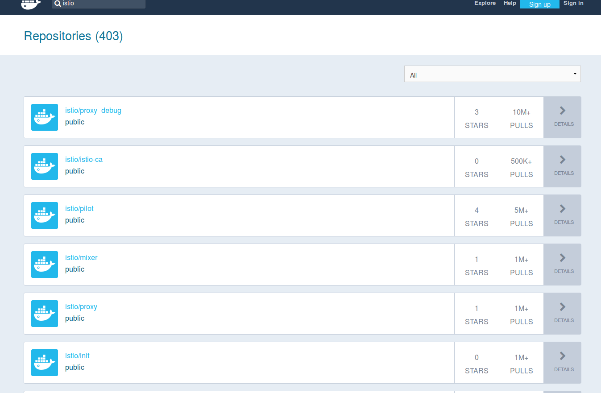
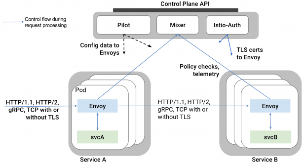
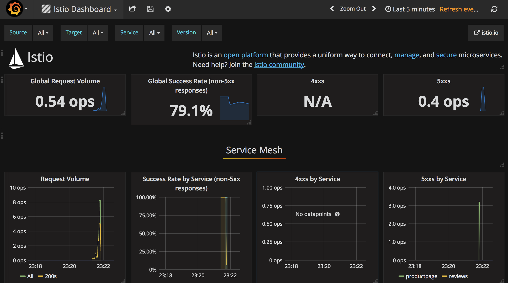

!SLIDE[bg=_images/backgrounds/white_bg.png]

# Istio

* 'service mesh'
* Still in Beta
* Founded by IBM, Google, and Lyft
* Leverages Envoy from Lyft

!SLIDE[bg=_images/backgrounds/white_bg.png]

# What is a service mesh

* In this case, lots of proxying
* Creates a 'smart platform' layer underneath apps

!SLIDE[bg=_images/backgrounds/white_bg.png]

# Istio Key features

* Mutual TLS between all services in k8s
* Metrics and tracing between service calls 
* Network control policies
* Native HTTP/2 and grpc support
* Request retries

!SLIDE[bg=_images/backgrounds/white_bg.png]

.huge Why offload to the platform? Can't I code all this myself?

!SLIDE[bg=_images/backgrounds/white_bg.png]

# It's still super beta

!SLIDE[bg=_images/backgrounds/white_bg.png]

# Service Mesh

!SLIDE[bg=_images/backgrounds/white_bg.png] commandline incremental

# "sidecar"

    $ kubectl describe pod/productpage-v1-5f9b797dfc-6sxdx | grep -i container
    Init Containers:
        Container ID:  docker://794981cc316dd818a9186d1312cd40286f8d737345efb132670b2a7e8705ec24
        Container ID:  docker://6cb99ae207c9992412e79dfc203ff864dfd0fe9e9b01e55e31c20894fac6fb4f
    Containers:
        Container ID:   docker://fef1055b03c3076b1827b2175b3a503c733e531ffdc6243c2dbeceb78f24944e
        Container ID:  docker://fbd28c8248cc810e49599cf64ee00b387fd635a4ee6e1e43829ccb268742dd1e

!SLIDE[bg=_images/backgrounds/white_bg.png]

# Service Mesh

