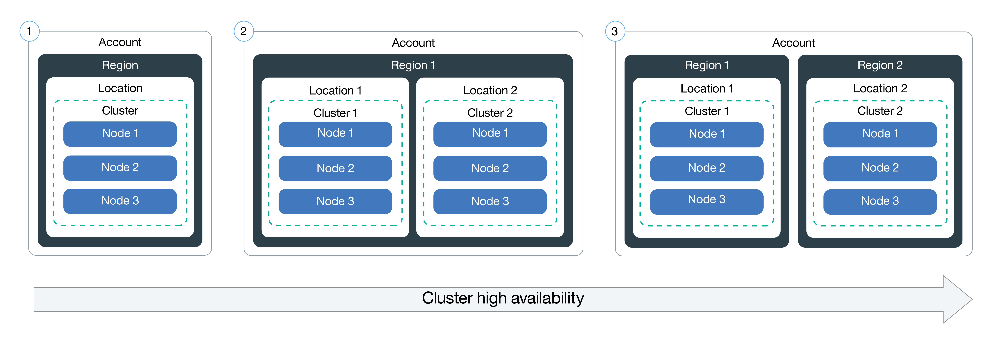

# Lab 2: Scale and update apps -- services, replica sets, and health checks

In this lab, understand how to update the number of replicas a deployment has and how to safely roll out an update on Kubernetes. Learn, also, how to perform a simple health check.

For this lab, you need a running deployment with a single replica. At
the end of the previous lab, we cleaned up the running
deployment. Let's first recreate that deployment with:
```
kubectl run hello-world --image=registry.ng.bluemix.net/<my_namespace>/hello-world
```

# 1. Scale apps with replicas

A *replica* is how Kubernetes accomplishes scaling out a deployment. A replica is a copy of a pod that already contains a running service. By having multiple replicas of a pod, you can ensure your deployment has the available resources to handle increasing load on your application.

1. `kubectl` provides a `scale` subcommand to change the size of an
   existing deployment. Let's us it to go from our single running
   instance to 10 instances.
   
   ``` console 
   $ kubectl scale --replicas=10 deployment hello-world
   deployment "hello-world" scaled
   ```

    Kubernetes will now act according to the desired state model to
    try and make true, the condition of 10 replicas. It will do this
    by starting new pods with the same configuration.

4. To see your changes being rolled out, you can run: `kubectl rollout status deployment/hello-world`.

   The rollout might occur so quickly that the following messages might _not_ display:

   ```
   => kubectl rollout status deployment/hello-world
   Waiting for rollout to finish: 1 of 10 updated replicas are available...
   Waiting for rollout to finish: 2 of 10 updated replicas are available...
   Waiting for rollout to finish: 3 of 10 updated replicas are available...
   Waiting for rollout to finish: 4 of 10 updated replicas are available...
   Waiting for rollout to finish: 5 of 10 updated replicas are available...
   Waiting for rollout to finish: 6 of 10 updated replicas are available...
   Waiting for rollout to finish: 7 of 10 updated replicas are available...
   Waiting for rollout to finish: 8 of 10 updated replicas are available...
   Waiting for rollout to finish: 9 of 10 updated replicas are available...
   deployment "hello-world" successfully rolled out
   ```

5. Once the rollout has finished, ensure your pods are running by using: `kubectl get pods`.

   You should see output listing 10 replicas of your deployment:

   ```
   => kubectl get pods
   NAME                          READY     STATUS    RESTARTS   AGE
   hello-world-562211614-1tqm7   1/1       Running   0          1d
   hello-world-562211614-1zqn4   1/1       Running   0          2m
   hello-world-562211614-5htdz   1/1       Running   0          2m
   hello-world-562211614-6h04h   1/1       Running   0          2m
   hello-world-562211614-ds9hb   1/1       Running   0          2m
   hello-world-562211614-nb5qp   1/1       Running   0          2m
   hello-world-562211614-vtfp2   1/1       Running   0          2m
   hello-world-562211614-vz5qw   1/1       Running   0          2m
   hello-world-562211614-zksw3   1/1       Running   0          2m
   hello-world-562211614-zsp0j   1/1       Running   0          2m
   ```
   
**Tip:** Another way to improve availability is to [add clusters and regions]( https://console.bluemix.net/docs/containers/cs_planning.html#cs_planning_cluster_config) to your deployment, as shown in the following diagram: 

 

# 2. Update and roll back apps

Kubernetes allows you to use a rollout to update an app deployment with a new Docker image.  This allows you to easily update the running image and also allows you to easily undo a rollout, if a problem is discovered after deployment.

In the previous lab, we created an image with a `1` tag. Let's make a version of the image that includes new content and use a `2` tag. This lab also contains a `Dockerfile`. Let's build and push it up to our image registry.

To update and roll back:
1. Build the new docker image with a `2` tag:

   ```docker build --tag registry.ng.bluemix.net/<my_namespace>/hello-world:2 .```

2. Push the image to the IBM Cloud Container Registry:

   ```docker push registry.ng.bluemix.net/<my_namespace>/hello-world:2```

3. Using `kubectl`, you can now update your deployment to use the
   latest image. `kubectl` allows you to change details about existing
   resources with the `set` subcommand. We can use it to change the
   image being used.

    ```kubectl set image deployment/hello-world hello-world=registry.ng.bluemix.net/<namespace>/hello-world:2```

    Note that a pod could have multiple containers, in which case each container will have its own name.  Multiple containers can be updated at the same time.  ([More information](https://kubernetes.io/docs/user-guide/kubectl/kubectl_set_image/).)

4. Run `kubectl rollout status deployment/hello-world` or `kubectl get replicasets` to check the status of the rollout. The rollout might occur so quickly that the following messages might _not_ display:

   ```
   => kubectl rollout status deployment/hello-world
   Waiting for rollout to finish: 2 out of 10 new replicas have been updated...
   Waiting for rollout to finish: 3 out of 10 new replicas have been updated...
   Waiting for rollout to finish: 3 out of 10 new replicas have been updated...
   Waiting for rollout to finish: 3 out of 10 new replicas have been updated...
   Waiting for rollout to finish: 4 out of 10 new replicas have been updated...
   Waiting for rollout to finish: 4 out of 10 new replicas have been updated...
   Waiting for rollout to finish: 4 out of 10 new replicas have been updated...
   Waiting for rollout to finish: 4 out of 10 new replicas have been updated...
   Waiting for rollout to finish: 4 out of 10 new replicas have been updated...
   Waiting for rollout to finish: 5 out of 10 new replicas have been updated...
   Waiting for rollout to finish: 5 out of 10 new replicas have been updated...
   Waiting for rollout to finish: 5 out of 10 new replicas have been updated...
   Waiting for rollout to finish: 6 out of 10 new replicas have been updated...
   Waiting for rollout to finish: 6 out of 10 new replicas have been updated...
   Waiting for rollout to finish: 6 out of 10 new replicas have been updated...
   Waiting for rollout to finish: 7 out of 10 new replicas have been updated...
   Waiting for rollout to finish: 7 out of 10 new replicas have been updated...
   Waiting for rollout to finish: 7 out of 10 new replicas have been updated...
   Waiting for rollout to finish: 7 out of 10 new replicas have been updated...
   Waiting for rollout to finish: 8 out of 10 new replicas have been updated...
   Waiting for rollout to finish: 8 out of 10 new replicas have been updated...
   Waiting for rollout to finish: 8 out of 10 new replicas have been updated...
   Waiting for rollout to finish: 8 out of 10 new replicas have been updated...
   Waiting for rollout to finish: 9 out of 10 new replicas have been updated...
   Waiting for rollout to finish: 9 out of 10 new replicas have been updated...
   Waiting for rollout to finish: 9 out of 10 new replicas have been updated...
   Waiting for rollout to finish: 1 old replicas are pending termination...
   Waiting for rollout to finish: 1 old replicas are pending termination...
   Waiting for rollout to finish: 1 old replicas are pending termination...
   Waiting for rollout to finish: 9 of 10 updated replicas are available...
   Waiting for rollout to finish: 9 of 10 updated replicas are available...
   Waiting for rollout to finish: 9 of 10 updated replicas are available...
   deployment "hello-world" successfully rolled out
   ```

   ```
   => kubectl get replicasets
   NAME                   DESIRED   CURRENT   READY     AGE
   hello-world-1663871401   9         9         9         1h
   hello-world-3254495675   2         2         0         <invalid>
   => kubectl get replicasets
   NAME                   DESIRED   CURRENT   READY     AGE
   hello-world-1663871401   7         7         7         1h
   hello-world-3254495675   4         4         2         <invalid>
   ...
   => kubectl get replicasets
   NAME                   DESIRED   CURRENT   READY     AGE
   hello-world-1663871401   0         0         0         1h
   hello-world-3254495675   10        10        10        1m
   ```

5. Perform a `curl <public-IP>:<nodeport>` to confirm your new code is active.

6. If you decide to undo your latest rollout, call: `kubectl rollout undo deployment/<name-of-deployment>`.

# 3. Check the health of apps

Kubernetes uses availability checks (liveness probes) to know when to restart a container. For example, liveness probes could catch a deadlock, where an application is running, but unable to make progress. Restarting a container in such a state can help to make the application more available despite bugs.

Also, Kubernetes uses readiness checks to know when a container is ready to start accepting traffic. A pod is considered ready when all of its containers are ready. One use of this check is to control which pods are used as backends for services. When a pod is not ready, it is removed from load balancers.

In this example, we have defined a HTTP liveness probe to check health of the container every five seconds. For the first 10-15 seconds the `/healthz` returns a `200` response and will fail afterward. Kubernetes will automatically restart the service.  

1. Open the `healthcheck.yml` file with a text editor. This configuration script combines a few steps from the previous lesson to create a deployment and a service at the same time. App developers can use these scripts when updates are made or to troubleshoot issues by re-creating the pods:

   1. Update the details for the image in your private registry namespace:

      ```
      image: "registry.<region>.bluemix.net/<namespace>/hello-world:2"
      ```

   2. Note the HTTP liveness probe that checks the health of the container every five seconds.

      ```
      livenessProbe:
                  httpGet:
                    path: /healthz
                    port: 8080
                  initialDelaySeconds: 5
                  periodSeconds: 5
      ```

   3. In the **Service** section, note the `NodePort`. Rather than generating a random NodePort like you did in the previous lesson, you can specify a port in the 30000 - 32767 range. This example uses 30072.

2. Run the configuration script in the cluster. When the deployment and the service are created, the app is available for anyone to see:

   ```
   kubectl apply -f healthcheck.yml
   ```
   
   Now that all the deployment work is done, check how everything turned out. You might notice that because more instances are running, things might run a bit slower.

3. Open a browser and check out the app. To form the URL, combine the IP with the NodePort that was specified in the configuration script. To get the public IP address for the worker node:

   ```
   bx cs workers <cluster-name>
   ```

   In a browser, you'll see a success message. If you do not see this text, don't worry. This app is designed to go up and down.

   For the first 10 - 15 seconds, a 200 message is returned, so you know that the app is running successfully. After those 15 seconds, a timeout message is displayed, as is designed in the app.

4. Launch your Kubernetes dashboard:

   1. Get your credentials for Kubernetes.
      
      ```
      kubectl config view -o jsonpath='{.users[0].user.auth-provider.config.id-token}'
      ```

   2. Copy the **id-token** value that is shown in the output.     
   
   3. Set the proxy with the default port number.

      ```
      kubectl proxy
      ```

      Output:

      ```
      Starting to serve on 127.0.0.1:8001
      ```
   
   4. Sign in to the dashboard.
      
      1. Open the following URL in a web browser.
         
         ```
         http://localhost:8001/api/v1/namespaces/kube-system/services/https:kubernetes-dashboard:/proxy/
         ```
      
      2. In the sign-on page, select the **Token** authentication method.
 
      3. Then, paste the **id-token** value that you previously copied into the **Token** field and click **SIGN IN**.
  
   In the **Workloads** tab, you can see the resources that you created. From this tab, you can continually refresh and see that the health check is working. In the **Pods** section, you can see how many times the pods are restarted when the containers in them are re-created. You might happen to catch errors in the dashboard, indicating that the health check caught a problem. Give it a few minutes and refresh again. You see the number of restarts changes for each pod.

5. Ready to delete what you created before you continue? This time, you can use the same configuration script to delete both of the resources you created.

   ```kubectl delete -f healthcheck.yml```

6. When you are done exploring the Kubernetes dashboard, in your CLI, enter `CTRL+C` to exit the `proxy` command.


Congratulations! You deployed the second version of the app. You had to use fewer commands, learned how health check works, and edited a deployment, which is great! Lab 2 is now complete.
