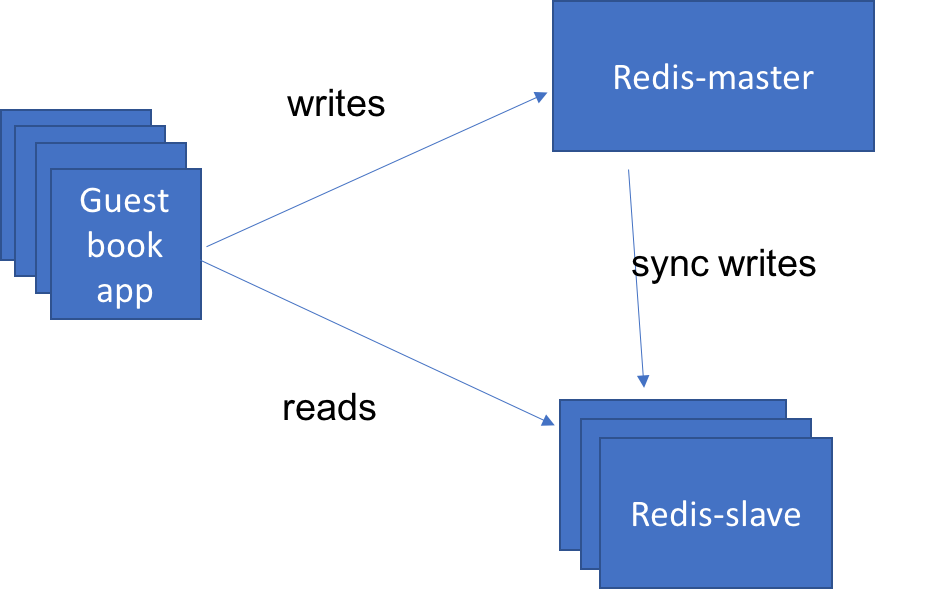

# Lab 3: Scale and update apps natively by building multi-tier applications

In this lab, you'll deploy the same guestbook application from the 
previous lab by using a different method. Instead of using `kubectl`,
you will deploy the application by using
configuration files. The configuration file mechanism allows you to have more
fine-grained control over all of resources being created within the
Kubernetes cluster.

Before we work with the application, we need to clone a github repo:

```
$ git clone https://github.com/IBM/guestbook.git
```

This repo contains multiple versions of the guestbook application
as well as the configuration files that we'll use to deploy the pieces of the application.

Change the directory by running the command `cd guestbook`. You will find all the
configurations files for this exercise under the directory `v1`.

## 1. Scale apps natively

Kubernetes can deploy an individual pod to run an application, but when you
need to scale it to handle a large number of requests a `Deployment` is the
resource you want to use.
A Deployment manages a collection of similar pods. When you ask for a specific number of replicas,
the Kubernetes Deployment Controller will attempt to maintain that replica number at all times.

### Create objects

Every Kubernetes object that we create should provide two nested object fields
that govern the object’s configuration: The object `spec` and the object
`status`. Object `spec` defines the desired state, and object `status`
contains the information about the actual state of the
resource, which the Kubernetes system provided. 
As described before, Kubernetes will attempt to reconcile
your desired state with the actual state of the system.

To create the Object, you need the `apiVersion`,
the `kind`, and the `metadata`
about the Object (such as a `name`, set of `labels`, and optionally the `namespace`).

Consider the following deployment configuration for the guestbook application:

**guestbook-deployment.yaml**

```yaml
apiVersion: apps/v1
kind: Deployment
metadata:
  name: guestbook
  labels:
    app: guestbook
spec:
  replicas: 3
  selector:
    matchLabels:
      app: guestbook
  template:
    metadata:
      labels:
        app: guestbook
    spec:
      containers:
      - name: guestbook
        image: ibmcom/guestbook:v1
        ports:
        - name: http-server
          containerPort: 3000
```

The above configuration file creates a deployment object named `guestbook`
with a pod containing a single container running the image
`ibmcom/guestbook:v1`. The configuration also specifies a replica number
that is set to `3`, so Kubernetes will run three active pods at
all times.

### Create the guestbook Deployment

   To create a Deployment by using this configuration file, use the
   following command:

   ``` console
   $ kubectl create -f guestbook-deployment.yaml
   deployment "guestbook" created
   ```

### List the pod

  Now you can list the pods that Kubernetes created by label name.
  Use the label `app` with a value of `guestbook`. This matches
  the labels that were defined above in the yaml file in the
  `spec.template.metadata.labels` section:

   ```console 
   $ kubectl get pods -l app=guestbook
   ```

### Change the number of replicas

When you change the number of replicas in the configuration, Kubernetes will
try to add or remove pods from the system to match your request. You can
make these modifications by using the following command:

   ```console
   $ kubectl edit deployment guestbook
   ```

This will retrieve the latest configuration for the Deployment from the
Kubernetes server and then load it into an editor for you. You'll notice
that there are a lot more fields in this version than the original yaml
file we used. This is because it contains all of the properties about the
Deployment that Kubernetes knows about, not just the ones we specified
when we created it. Notice that it now contains the `status`
section mentioned previously.

### Edit the Deployment file

You can also edit the Deployment file that we used to create the Deployment
to make changes. Use the following command to make the change 
when you edit the deployment locally.

   ```console
   $ kubectl apply -f guestbook-deployment.yaml
   ```

This will ask Kubernetes to "diff" our yaml file with the current state
of the Deployment and apply just those changes.

We can now define a Service object to expose the deployment to external
clients.

**guestbook-service.yaml**

```yaml
apiVersion: v1
kind: Service
metadata:
  name: guestbook
  labels:
    app: guestbook
spec:
  ports:
  - port: 3000
    targetPort: http-server
  selector:
    app: guestbook
  type: LoadBalancer
```

### Setting up routes

The above configuration creates a Service resource named `guestbook`. A Service
creates a network path for incoming traffic to your running
application. In this case, we are setting up a route from port 3000 on the
cluster to the "http-server" port on our app, which is port 3000 per the
Deployment container spec.

  1. Create the guestbook service by using the same type of command
  that we used when we created the Deployment:

    ` $ kubectl create -f guestbook-service.yaml `

  2. Test the guestbook app by using the url:
    `<your-cluster-ip>:<node-port>`

      To get the `nodeport` and `public-ip`, use:

      `$ kubectl describe service guestbook`
      and
      `$ bx cs workers <name-of-cluster>`


## 2. Connect to a backend service

If you look at the guestbook source code under the `guestbook/v1/guestbook`
directory, you'll notice that it is written to support a variety of data
stores. By default, it will keep the log of guestbook entries in memory,
which is ok for testing purposes. As you get into a more "real" environment
where you scale your application, that model will not work.
Based on which instance of the application where users are routed, they'll see
very different results.
To solve this, we need to have all instances of our app share the same data
store. In this case, we're going to use a Redis database that we deploy to our
cluster. This instance of Redis will be defined in a similar manner to the guestbook.

### Create a Redis database

For this lab, you'll use the below yaml to create a Redis database in a Deployment, `redis-master`.
It will create a single instance with replicas set to `1`, and the guestbook app instances
will connect it to persist data, as well as read the persisted data back.
The image running in the container is `redis:2.8.23` and exposes the standard Redis port 6379.

1. Create a Redis database:

  **redis-master-deployment.yaml**

  ```yaml
  apiVersion: apps/v1
  kind: Deployment
  metadata:
    name: redis-master
    labels:
      app: redis
      role: master
  spec:
    replicas: 1
    selector:
      matchLabels:
        app: redis
        role: master
    template:
      metadata:
        labels:
          app: redis
          role: master
      spec:
        containers:
        - name: redis-master
          image: redis:2.8.23
          ports:
          - name: redis-server
            containerPort: 6379
```

2. Create a Redis Deployment:

    ```console
    $ kubectl create -f redis-master-deployment.yaml
    ```

3. Check to see that the Redis server pod is running:

    ```console
    $ kubectl get pods -lapp=redis,role=master
    NAME                 READY     STATUS    RESTARTS   AGE
    redis-master-q9zg7   1/1       Running   0          2d
    ```

4. Test the Redis standalone:

    ` $ kubectl exec -it redis-master-q9zg7 redis-cli `

    The `kubectl exec` command will start a secondary process in the specified
    container. In this case, we're asking for the `redis-cli` command to be
    executed in the container named `redis-master-q9zg7`.  When this process
    ends, the `kubectl exec` command will also exit, but the other processes in
    the container will not be impacted.

    Once in the container, we can use the `redis-cli` command to make sure the
    redis database is running properly. (If not, you will need to reconfigure it.)

    ```console
    redis-cli> ping
    PONG
    redis-cli> exit
    ```

5. Now we need to expose the `redis-master` Deployment as a Service so that the
  guestbook application can connect to it through DNS lookup. 

  **redis-master-service.yaml**

  ```yaml
  apiVersion: v1
  kind: Service
  metadata:
    name: redis-master
    labels:
      app: redis
      role: master
  spec:
    ports:
    - port: 6379
      targetPort: redis-server
    selector:
      app: redis
      role: master
```

  This creates a Service object named `redis-master` and configures it to target
  port 6379 on the pods selected by the selectors `app=redis` and`role=master`.

6. Create the service to access `redis master`:

    ``` $ kubectl create -f redis-master-service.yaml ```

7. Restart the guestbook app so that it will find the Redis service to use database:

    ```console
    $ kubectl delete deploy guestbook 
    $ kubectl create -f guestbook-deployment.yaml
    ```

8. Test the guestbook app by using the url:
    `<your-cluster-ip>:<node-port>`
  
You can see now that when you open up multiple browsers and refresh the page
to access the different copies of guestbook, that they all have a consistent state.
All instances write to the same backing persistent storage, and all instances
read from that storage to display the guestbook entries that were stored.

### Scale Redis

We have a simple 3-tier application running, but we do need to scale the
application if traffic increases. Our main bottleneck is that we only have
one database server to process each request coming though guestbook. One
simple solution is to separate the reads and writes, so that they go to
different databases that are replicated properly to achieve data consistency.

  

1. Create a deployment named `redis-slave` that can talk to the Redis database to
  manage data reads. Use the pattern where
  we can scale the reads using `redis slave deployment`, which can run several
  instances to read. Here, `redis slave deployment` is configured to run two replicas.

  

  **redis-slave-deployment.yaml**

  ```yaml
  apiVersion: apps/v1
  kind: Deployment
  metadata:
    name: redis-slave
    labels:
      app: redis
      role: slave
  spec:
    replicas: 2
    selector:
      matchLabels:
        app: redis
        role: slave
    template:
      metadata:
        labels:
          app: redis
          role: slave
      spec:
        containers:
        - name: redis-slave
          image: kubernetes/redis-slave:v2
          ports:
          - name: redis-server
            containerPort: 6379
```

2. Create the pod that will run `redis slave deployment`:
   ``` $ kubectl create -f redis-slave-deployment.yaml ```

3. Check whether all the slave replicas are running:
  ```
  console
  $ kubectl get pods -lapp=redis,role=slave
  NAME                READY     STATUS    RESTARTS   AGE
  redis-slave-kd7vx   1/1       Running   0          2d
  redis-slave-wwcxw   1/1       Running   0          2d
 ```

4. Go into one of the pods and look at the database to see
  that everything looks correct:

  ```
  console
  $ kubectl exec -it redis-slave-kd7vx  redis-cli
  127.0.0.1:6379> keys *
  1) "guestbook"
  127.0.0.1:6379> lrange guestbook 0 10
  1) "hello world"
  2) "welcome to the Kube workshop"
  127.0.0.1:6379> exit
  ```

5. Deploy `redis slave service` so that we can access it by DNS name. Once redeployed,
  the application will send "read" operations to the `redis-slave` pods while
  "write" operations will go to the `redis-master` pods.

  **redis-slave-service.yaml**

  ```yaml
  apiVersion: v1
  kind: Service
  metadata:
    name: redis-slave
    labels:
      app: redis
      role: slave
  spec:
    ports:
    - port: 6379
      targetPort: redis-server
    selector:
      app: redis
      role: slave
  ```

6. Create the service to access `redis slave`.
  ``` $ kubectl create -f redis-slave-service.yaml ```

7. Restart guestbook so that it will find the slave service to read from.
  ```console
  $ kubectl delete deploy guestbook
  $ kubectl create -f guestbook-deployment.yaml
  ```
    
8. Test the guestbook app by using the url `<your-cluster-ip>:<node-port>`.

9. Clean up your environment:

  ```console
  $ kubectl delete -f guestbook-deployment.yaml
  $ kubectl delete -f guestbook-service.yaml
  $ kubectl delete -f redis-slave-service.yaml
  $ kubectl delete -f redis-slave-deployment.yaml 
  $ kubectl delete -f redis-master-service.yaml 
  $ kubectl delete -f redis-master-deployment.yaml
  ```

You may now proceed to Lab 4. 
